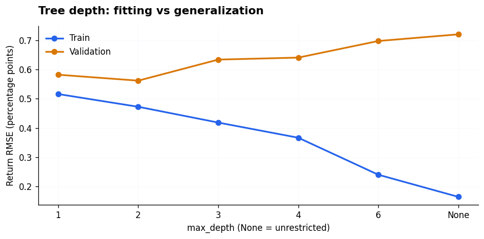
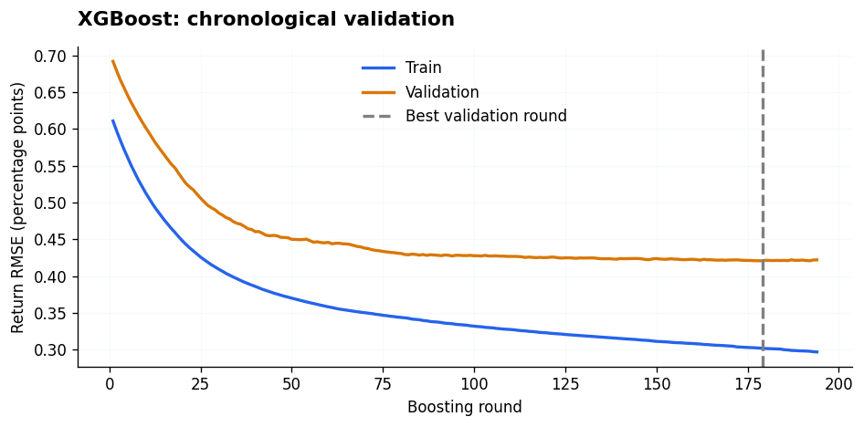

# 时间序列研究代码模板 · 中文 Notebook

面向限时数据分析的参考手册：**按问题找模板，复制初始化单元和对应代码，修改字段，再检查输出。**
内容以时间序列与多资产面板为主，也适用于设备监测、业务指标和其他带时间戳的数据。

**70 个基础模板 + 18 个美观版变体 + 18 个回测案例 + 16 个机器学习案例 · 70 张实际示例图 · 中文场景说明和代码注释。**

## 直接打开

| Notebook | 内容 | 当前状态 |
|---|---|---|
| [01 · pandas 场景模板](notebooks/01_pandas_time_series_templates.ipynb) | 读写、清洗、索引、分组、拼表、时间窗口、重采样、时区、时点连接 | 已完成 |
| [02 · 时间序列数据处理与可视化](notebooks/02_time_series_processing_visualization.ipynb) | 数据质量、缺失与异常、特征与标签，以及按研究问题选择图表 | 已完成 |
| [02b · 可视化美观版](notebooks/02b_time_series_visualization_polished.ipynb) | 相同输入表，统一主题、清晰标注、数值热图与汇报用图形 | 已完成 |
| [03 · 回测与可视化 Cheat Sheet](notebooks/03_modeling_and_backtesting.ipynb) | 18 种记账与评估场景，每例先 display 输入表，再给回测结果和图形 | 已完成；完整机器学习建模不在本册范围 |
| [04 · 机器学习与可视化 Cheat Sheet](notebooks/04_machine_learning_cheat_sheet.ipynb) | scikit-learn、树模型、可选 XGBoost、时间验证、模型诊断和预测接回测 | 已完成；每例从 DataFrame 开始 |

- **[按场景检索所有模板](docs/RECIPE_INDEX.md)**：也可在 notebook 中搜索 `P01`、`D01`、`V01`、`S01`、`B01`、`M01` 等编号。
- **[数据接入指南](docs/DATA_ADAPTER.md)**：把陌生数据映射到模板字段，而不是硬套金融含义。
- **[运行与兼容说明](docs/COMPATIBILITY.md)**：Python 3.8 参考环境与版本差异。
- `docs/` 中的同名 HTML 是已运行的只读版本，下载后用浏览器打开。GitHub 中直接打开 `.ipynb` 可以查看代码、表格和内嵌图片。

## 美观版预览

基础版 V01–V18 和美观版 S01–S18 一一对应，使用相同输入表。美观版文件独立，主题只需初始化一次。

每个可视化案例按 **输入数据表 → 要做什么 → 代码 → 图形结果** 排列。输入表逐行展示，列名统一从 `df` 读取，完整预览见 [图表目录](docs/GALLERY.md)。

绘图统一采用 `plt.figure(figsize=(...))`、`plt.plot()`、`plt.title()`、`plt.xlabel()` 等写法。
每个案例只画一张简单图，最后用 `plt.tight_layout()` 和 `plt.show()` 展示；无需管理子图或坐标轴对象。

| 收益路径：突出最大波动 | 相关矩阵：直接标出数值 |
|---|---|
|  |  |
| 月度收益：百分数与灰色缺失格 | 回撤：标出区间最深跌幅 |
|  |  |

## 怎么复制最省时间

1. **P / D 模板**：先运行对应 notebook 的 setup，再选择模板。
2. **V 基础可视化**：只运行 02 的 B 部分 import。**S 美观版**：运行 02b 开头的主题初始化格。然后看案例的输入表及任务说明。
3. 已有自己的 `df`：对齐示例列名与单位，直接运行“绘图代码”格。没有数据：先运行同一案例的“示例建表”格。
4. 每个 V / S 案例使用独立小表，不依赖 `demo_panel`、`wide_ret` 等全局数据，也不依赖其他案例。日期转换、排序等必要步骤留在绘图格中。
5. 示例数据很小，只用于看懂代码。真实分析要确认频率、缺失、样本量和信息时点；预测研究先保留未来测试区间。

**B 回测案例：** 运行 03 的初始化格后，选择一个案例，先看实际 `display(df)` 输入表，再看执行时点与任务，接着复制回测格和绘图格。每个案例独立提供示例数据、完整输出、中文注释和使用限制，不依赖其他案例。

**M 机器学习案例：** 运行 04 初始化格，再任选 M01–M16。先 `display(df.head(8))` 看字段，再解释任务和信息时点，按时间切分、训练、展示预测/指标与图形。各例使用独立合成数据，sklearn 类在该例训练格中导入；无需先运行其他案例。

这里的图表全部来自可复现的合成示例，**不代表真实市场规律或可盈利策略**。中文说明与注释解释用途，图内使用英文标签以避免运行环境缺少中文字体。

## 回测怎么选

| 数据 / 任务 | 模板 |
|---|---|
| 收盘前已知仓位，收盘到收盘 | B01；收盘后才生成信号用 B02 下一开盘执行 |
| 当日开平仓；不规则日内记录 | B03 / B04 |
| 实际换手与交易费用；每日多资产权重 | B05 / B06 宽表 / B07 长表 |
| 每周再平衡，期间股数不变 | B08 |
| 固定金额投入；buy/hold/sell 指令账本 | B09 / B10 |
| 配对交易；多日持有且每天新开仓 | B11 / B12 |
| 波动率控制；训练/验证/测试选阈值 | B13 / B14 |
| 绩效与回撤；月度收益；相对基准；费用敏感性 | B15–B18 |

| 持仓漂移：实际交易日与其余日期 | 账户权益：买卖位置与费用 |
|---|---|
|  |  |

回测示例首先解释信号可用时点、成交价格、收益归属与资金口径；其中的交易账本可以核对现金、股数和实际成交费用。B15–B18 用于生成研究汇报中的指标和图形。

## 机器学习怎么选

| 数据 / 任务 | 模板 |
|---|---|
| 从价格构造特征与未来标签 | M01：因果窗口、label_end、边界隔离 |
| 先做连续值预测基线 | M02：LinearRegression / DummyRegressor |
| 数值有缺失、量纲不同；数值＋类别混合 | M03：Imputer / Scaler / Ridge；M04：ColumnTransformer / OneHotEncoder |
| 涨跌分类；正类少与概率阈值 | M05：LogisticRegression / 混淆矩阵；M06：验证选阈值 / PR曲线 |
| 基础树与集成 | M07：决策树；M08：随机森林；M09：HistGradientBoosting；M10：XGBoost |
| 时间调参；多资产滚动预测 | M11：TimeSeriesSplit / GridSearchCV；M12：按日期 Walk-forward |
| 模型解释、误差诊断、降维 | M13：置换重要性；M14：残差 / Rank IC；M15：PCA |
| 模型怎样变成可评估的交易策略 | M16：训练/验证/测试 → 阈值 → 仓位 → 费用与净值 |

| 树深度：训练与验证误差 | XGBoost：验证集决定停止轮数 |
|---|---|
|  |  |

04 的多数目标是当日开盘到收盘收益，特征假定盘前可用；预测未来多期收益的例子另记标签实现时间。数据和切分各不相同，不应跨案例比较 RMSE 来决定哪个模型更好。

## 按问题选择图表

| 你想回答的问题 | 合适的图 | 同时要报告什么 |
|---|---|---|
| 每天的收益怎样变化？ | V01 收益折线 | 小数 / 百分数、日期顺序 |
| 多个资产从同一起点走势如何？ | V02 归一化折线 | 共同起点、价格为正 |
| 数据缺在哪里、哪些列缺得多？ | V03 缺失热图、V04 缺失率柱图 | 预期日历、缺整行与缺字段 |
| 收益分布如何，有哪些大波动？ | V05 直方图、V06 极值标记 | 样本量、固定阈值的含义 |
| 波动和相关性是否变化？ | V07 滚动波动、V08 滚动相关 | 窗口长度、成对有效样本 |
| 多个收益序列是否相关？ | V09 相关矩阵 | 成对样本数表 |
| 今天和明天的变化是否有关？ | V10 滞后散点、V11 自相关 | 目标对齐、lag 的单位 |
| 星期或月份是否存在差异？ | V12 星期箱线图、V13 月度热图 | 每组样本量、完整月定义 |
| 哪些日期的成交量较大？ | V14 成交量柱图 | 数量单位 |
| 哪段时间用于训练和测试？ | V15 时间切分线 | 预先确定的切分日期 |
| 不同组的未来收益有何差异？ | V16 分组均值柱图 | 事先定义的分组与样本数 |
| 历史跌幅有多大？ | V17 回撤图 | 初始净值、无缺失收益 |
| 每小时发生多少事件？ | V18 事件计数柱图 | 采集区间、零事件与采集失败 |

## 本地运行

### Python 3.8 参考环境

```bash
git clone https://github.com/EnkiDoctor/timeseries-research-notebooks.git
cd timeseries-research-notebooks
python3.8 -m venv .venv
source .venv/bin/activate
python -m pip install -r requirements-py38.txt
python -m jupyterlab
```

Windows 的激活命令为 `.venv\Scripts\activate`；PowerShell 可运行 `.venv\Scripts\Activate.ps1`。
`requirements-py38.txt` 是练习用的固定版本组合，不代表任何现场机器的实际依赖版本。
如使用较新的 Python，可使用 `requirements.txt`。打开任一本已完成的 notebook 后，选择 **Restart Kernel → Run All**。
核心示例运行时不访问网络，不需要 API key，也无需下载真实行情。

04 的 scikit-learn 已加入基础依赖。**仅 M10 需要额外安装 XGBoost**：Python 3.8 使用 `python -m pip install -r requirements-xgboost-py38.txt`；现代 Python 使用 `python -m pip install -r requirements-xgboost.txt`。没有这个包或原生运行库时，M10 明确跳过，其余案例仍可执行。macOS 还可能需要 OpenMP，见 [兼容说明](docs/COMPATIBILITY.md)。

### 验证和生成阅读版

```bash
python scripts/run_notebooks.py --check-recipes --html
```

该命令从干净 kernel 执行五本已完成的 notebook（01、02、02b、03、04），再逐个检查“初始化＋单独模板”，结果写入忽略的 `artifacts/`。
维护者加上 `--write` 可更新已提交 notebook 的输出、`docs/` 阅读版与验证报告；随后运行 `python scripts/build_index.py` 更新目录。
生成脚本在 `scripts/build_01.py`、`scripts/build_02.py`、`scripts/build_02b.py`、`scripts/build_03.py`；基础小表在 `scripts/visualization_cases.py`，美观版写法在 `scripts/polished_visualization_cases.py`，回测案例在 `scripts/backtest_cases_a.py`、`scripts/backtest_cases_b.py`、`scripts/backtest_cases_c.py`；日常学习无需运行它们。重新生成会覆盖 notebook，请先保存自己的修改。

04 由 `scripts/build_04.py` 与 `scripts/ml_cases_a.py`、`scripts/ml_cases_b.py`、`scripts/ml_cases_c.py` 生成。CI 会安装可选 XGBoost 并加 `--require-optional`，确保 M10 实际训练；普通运行的验证报告会列出 `skipped_optional_recipes`。

本地已验证两套环境：Python 3.8.20 / pandas 1.5.3 / NumPy 1.24.4 / Matplotlib 3.7.5，以及 Python 3.12.14 / pandas 2.2.3 / NumPy 2.3.5 / Matplotlib 3.11.2。
五本合计 233 个代码格从干净 kernel 执行，122 个模板及变体逐个独立检查通过。04 另验证了 scikit-learn 1.3.2 / XGBoost 2.0.3 与 scikit-learn 1.7.2 / XGBoost 3.1.3。回测核对资金记账；机器学习核对测试标签扰动不改变训练预测、时间边界、训练期预处理及预测接回测的费用计算。详细记录见 [旧版环境报告](docs/validation.json) 与 [新版环境报告](docs/validation-modern.json)。

## 关键约定

- 默认一行是一个 `date × asset` 观测；真实问题也可以把 `asset` 换成设备、客户或产品。
- `ret` 是小数简单收益：`0.01` 表示 1%。价格、收益率、计数、流量、状态变量需要不同的清洗与聚合规则。
- `shift(1)` 指前一条观测；`rolling(20)` 指 20 条观测；它们不自动表示一个交易日或 20 个自然日。
- 缺失值不等于零。聚合时要检查**部分缺失**，不能只靠 `min_count=1`；交易日历也不能用普通工作日列表替代。
- 使用按发布时间的 backward as-of 连接；观察日期、发布时间、实际可用时间可能不同。
- 可视化可用于描述，不能自动证明因果关系、预测能力或策略收益。

## 数据、许可与使用范围

仓库中的默认数据和示例为原创合成数据，可在本仓库 MIT 许可下使用。数据生成与字段说明见 [data/README.md](data/README.md)。
额外提供 [French 行业收益下载脚本](scripts/download_french.py) 作为真实数据练习入口；下载文件保存在被忽略的 `data/downloads/`，第三方数据不适用本仓库 MIT 许可，使用前应阅读提供方条款与版本说明。

这是独立学习资料，不包含任何公司官方题目、评分标准或招聘文档。联网许可不必然涵盖预先准备的代码，使用时请遵守具体场景的规则。

API 的一手资料链接已附在 notebook 中；数据源另见 [Kenneth French Data Library](https://mba.tuck.dartmouth.edu/pages/faculty/ken.french/data_library.html)。
