# 图表预览

以下图片取自已执行的 02 基础版、02b 美观版与 03 回测 notebook。先看输入表、场景与任务，再查看代码和图形结果；03 每个案例先 display 输入 df，并展示回测结果表。

## V01 · 日收益：看收益随时间怎样变化

## V02 · 两只资产：从相同起点比较价格变化

## V03 · 缺失热图：看哪些日期、哪些列缺数据

## V04 · 缺失率：快速比较哪些字段最不完整

## V05 · 收益分布：看收益主要落在哪个范围

## V06 · 大幅波动：标出绝对收益超过 2% 的日期

## V07 · 滚动波动：看近期收益是否越来越不稳定

## V08 · 滚动相关：看两只资产的联动是否变化

## V09 · 相关矩阵：比较多只资产的同期收益关系

## V10 · 今日收益与下一交易日收益散点图

## V11 · 收益自相关柱状图

## V12 · 不同星期的收益箱线图

## V13 · 月度收益热力图

## V14 · 每日成交量柱状图

## V15 · 在时间序列上标出训练与测试边界

## V16 · 不同特征分组的下一期平均收益

## V17 · 从日收益计算并画回撤

## V18 · 每小时事件数量柱状图

## S01 · 日收益：看收益随时间怎样变化

## S02 · 两只资产：从相同起点比较价格变化

## S03 · 缺失热图：看哪些日期、哪些列缺数据

## S04 · 缺失率：快速比较哪些字段最不完整

## S05 · 收益分布：看收益主要落在哪个范围

## S06 · 大幅波动：标出绝对收益超过 2% 的日期

## S07 · 滚动波动：看近期收益是否越来越不稳定

## S08 · 滚动相关：看两只资产的联动是否变化

## S09 · 相关矩阵：比较多只资产的同期收益关系

## S10 · 今日收益与下一交易日收益散点图

## S11 · 收益自相关柱状图

## S12 · 不同星期的收益箱线图

## S13 · 月度收益热力图

## S14 · 每日成交量柱状图

## S15 · 在时间序列上标出训练与测试边界

## S16 · 不同特征分组的下一期平均收益

## S17 · 从日收益计算并画回撤

## S18 · 每小时事件数量柱状图

## B01 · 单资产：收盘成交，赚取下一段收盘到收盘收益

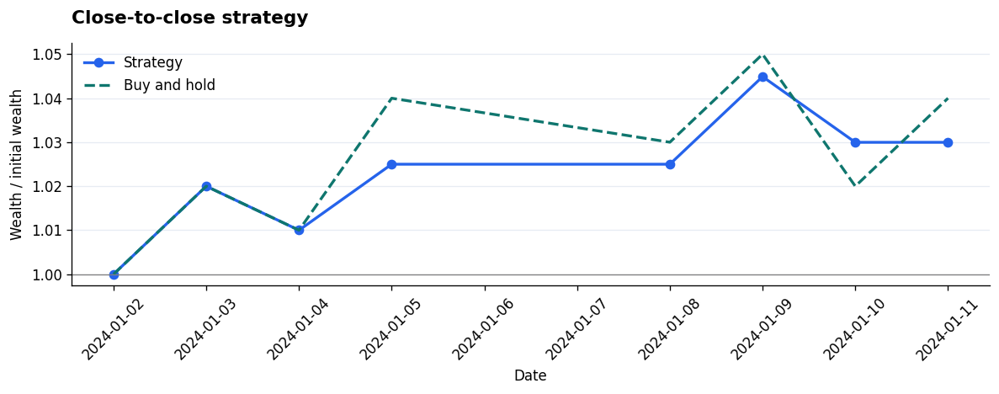

## B02 · 收盘后生成信号：下一期开盘成交，按开盘到开盘结算

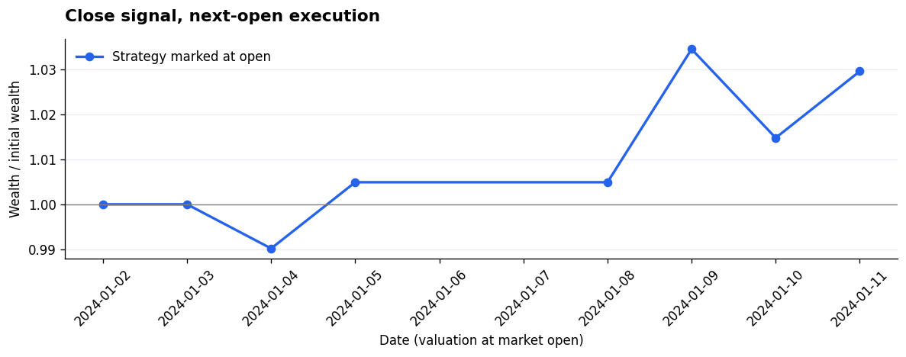

## B03 · 日内交易：开盘建仓、收盘平仓，隔夜空仓

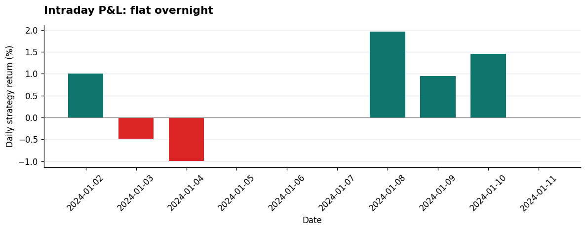

## B04 · 不规则日内bar：先逐段记账，再复合为每日收益

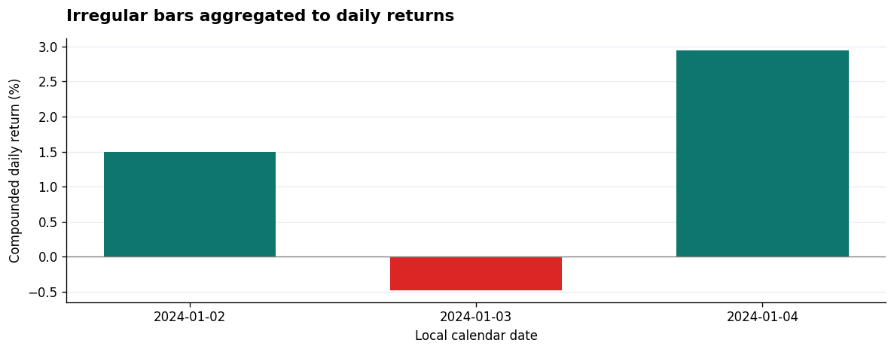

## B05 · 真实成交费用：用现金和股数记账，精确调整目标权重

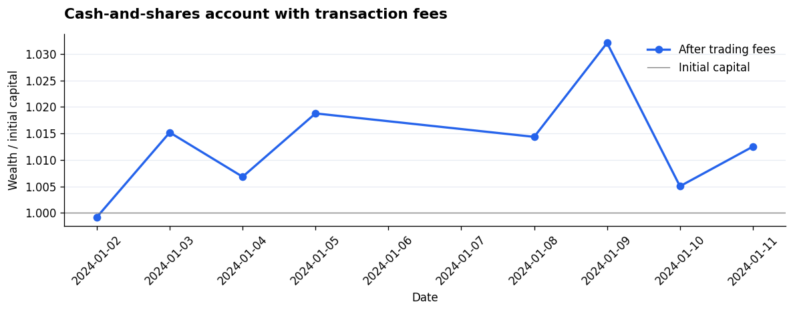

## B06 · 多资产宽表：先合并每日持仓收益，再复合组合净值

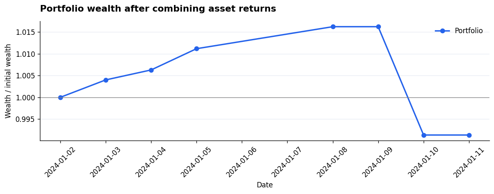

## B07 · 多资产长表：上一期权重 × 当期资产收益

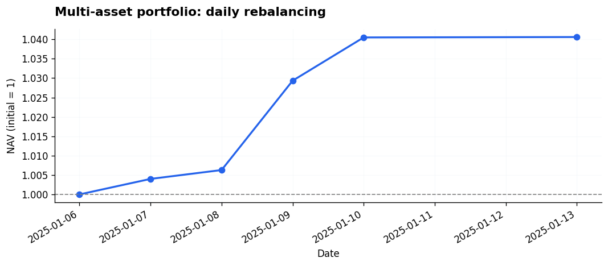

## B08 · 每周再平衡：固定股数持有，权重自然漂移

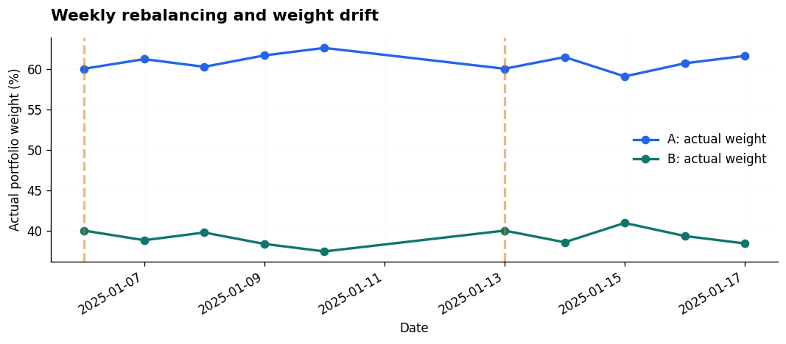

## B09 · 每天固定金额开平仓：累计金额损益，不复合交易收益

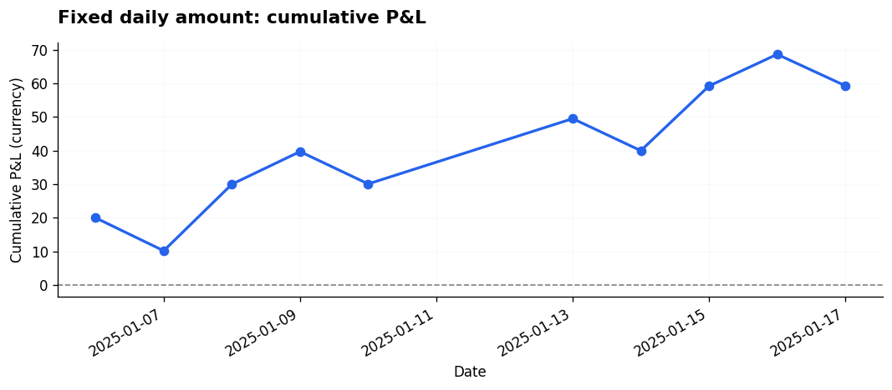

## B10 · 买入 / 持有 / 卖出指令：现金与股数账本

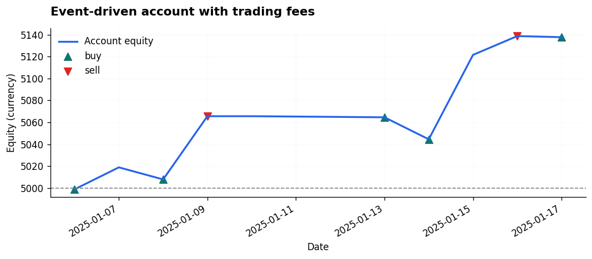

## B11 · 双腿配对交易：分别计算两条腿的收益贡献

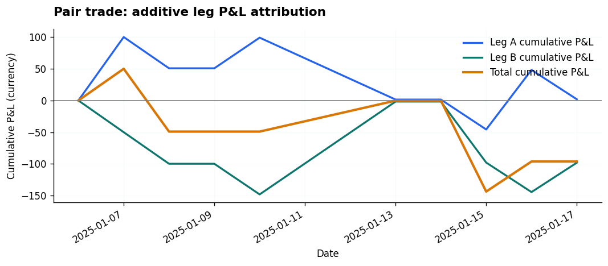

## B12 · 每次持有三期：三个错峰子账户处理重叠交易

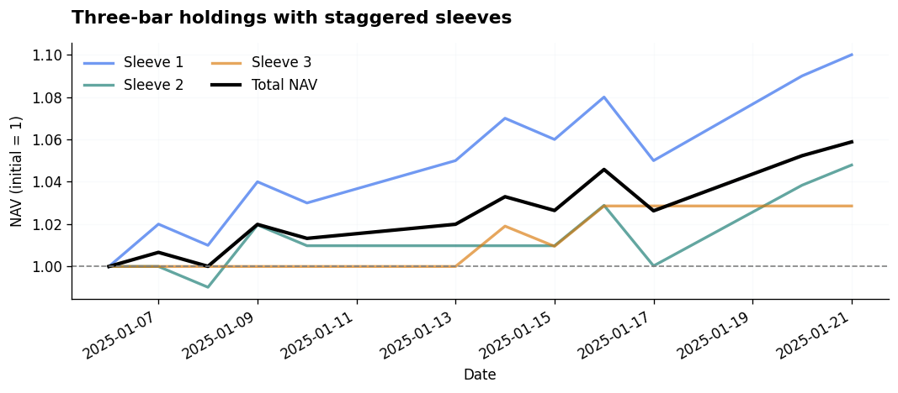

## B13 · 波动率目标仓位：只使用交易前已经知道的风险

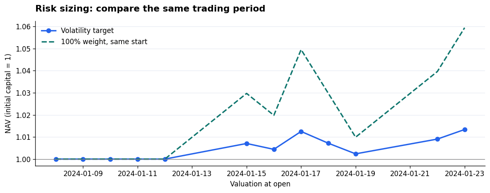

## B14 · 样本外回测：训练集定候选、验证集选阈值、测试集只评一次

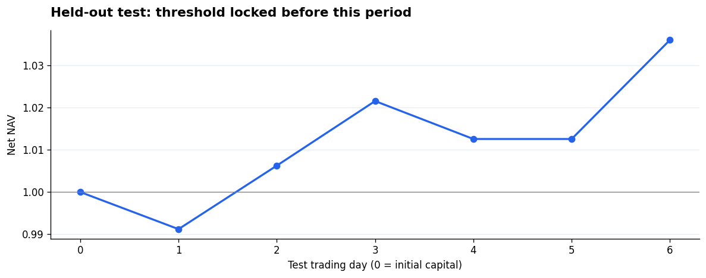

## B15 · 绩效表与回撤：从每日净收益计算，不漏掉首日亏损

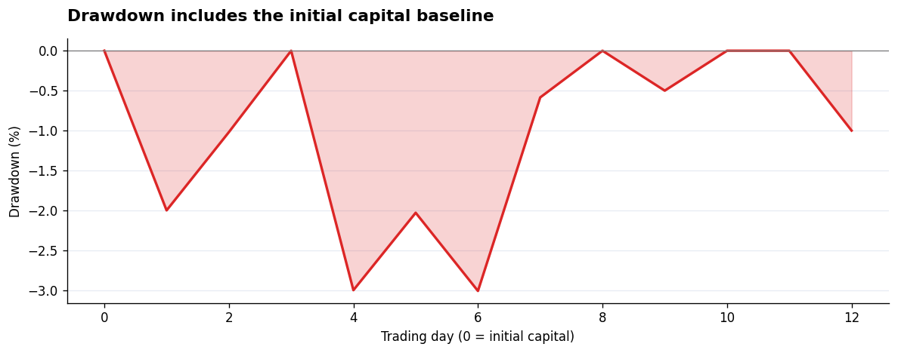

## B16 · 月度收益热图：空白月份与未结束月份分开处理

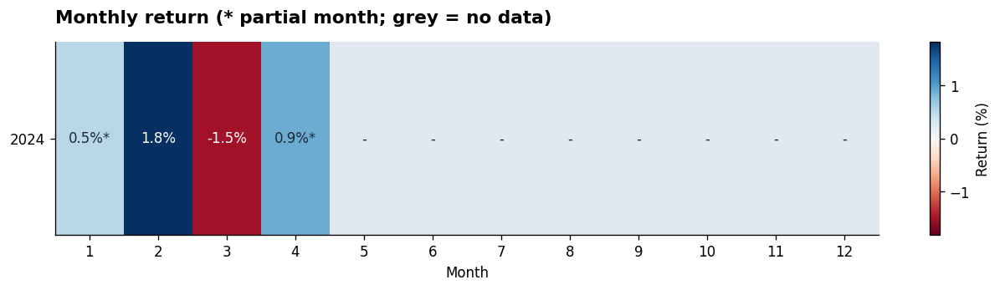

## B17 · 策略与基准：净值比较、主动收益与滚动风险

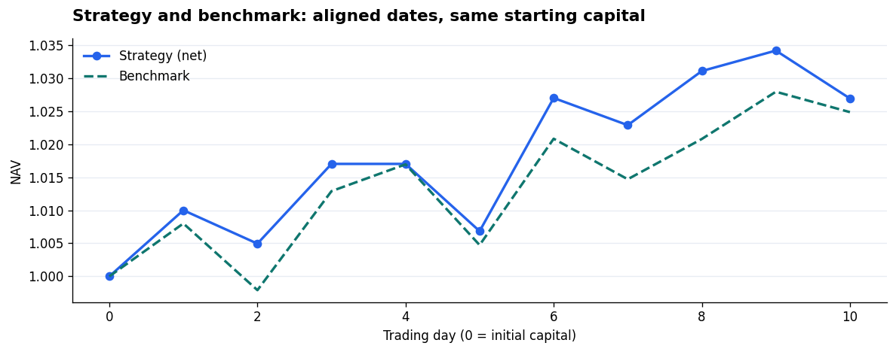

## B18 · 费用敏感性：同一交易计划在不同单边费率下重算账户

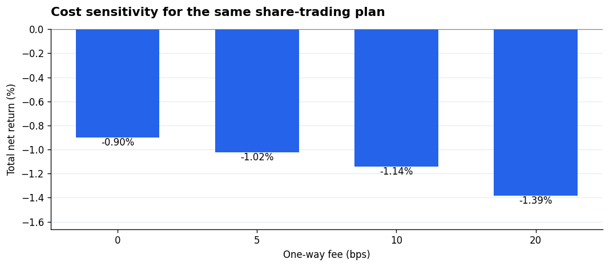
